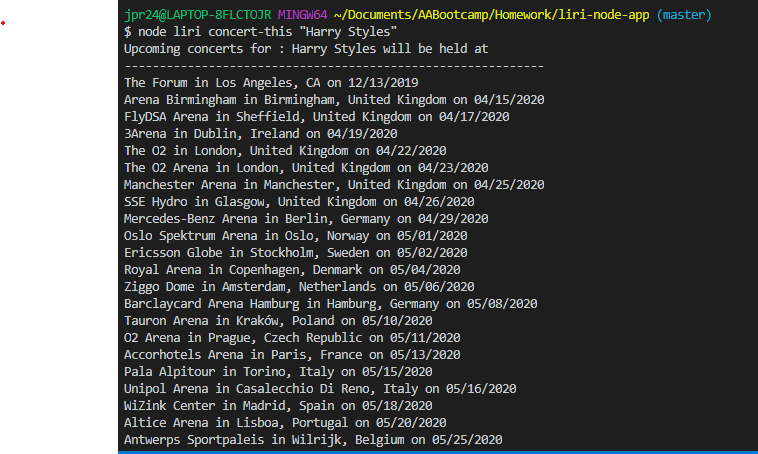
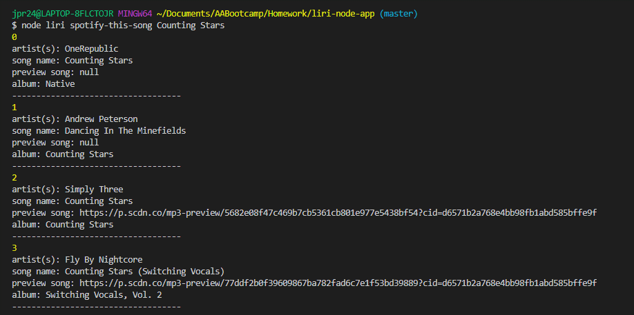
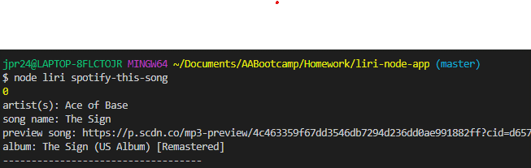
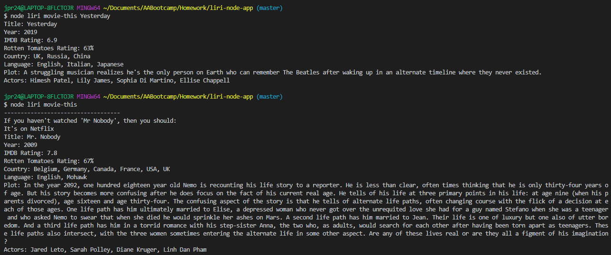
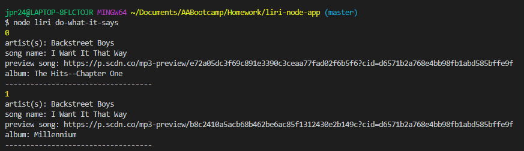

# liri-node-app

LIRI is like iPhone's SIRI, however, while SIRI is a Speech Interpretation and Recognition Interface, LIRI is a Language Interpretation and Recognition Interface. LIRI is a command line node app that takes in one of four parameters and returns the relative data.

## concert-this
This searches the Bands in Town Artist Events AP for an artist and renders the following information about each event to the terminal:

    Name of venue
    Venue location
    Date of the Event (using moment format "MM/DD/YYY")
    
  

## spotify-this-song

This shows the following information about the song:

    Artist(s)
    The song's name
    A preview link of the song from Spotify
    The album the song is from
    
    Note:  If no song selected the program defaults to "The Sign" by Ace of Base
      
  
  
    
## movie-this

This outputs the following information about the movie:

    Title
    Year
    IMDB Rating
    Country 
    Language
    Plot
    Actors
    
    Note:  If no movie selected the program defaults to "Mr Nobody" 
    
 

## do-what-it-says

This takes in the data held in the random.txt file and uses it to call the "spotify-this-song" command for the song "I Want it That Way".  The text can be changed by the user in the random.txt file to call "movie-this" or "concert-this" functions. 

 

